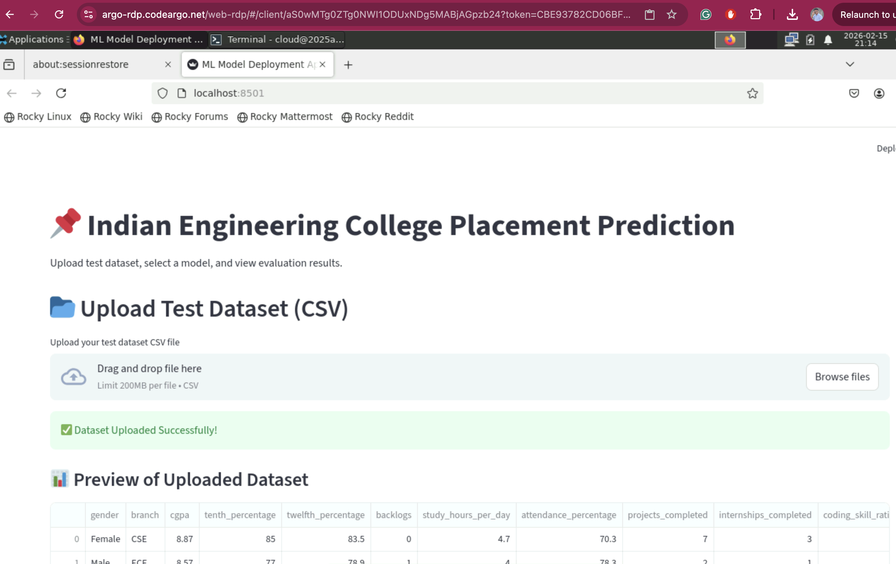

# Student Detail
## Name- Suresh Kumar Prajapat
## ID- 2025005430
## Email - 2025aa05430@wilp.bits-pilani.ac.in


# Github Link
https://github.com/sureshkpiitk/placement

# streamlit link
https://placement-u25ewttn4ykmkpeqcamcc6.streamlit.app/


# Placement Prediction Project

This project implements preprocessing, modeling, and evaluation for the Indian Engineering College Placement dataset.

1. Download the dataset from Kaggle and place the CSV in `data/indian_engineering_student_placement.csv` for feature and `data/placement_targets.csv` for target.
2. Create a Python virtual environment and install dependencies:

```bash
python3 -m venv venv
source venv/bin/activate
pip install -r requirements.txt
```

3. Run training (will create `best_model.joblib` and `evaluation.json`):

```bash
python -m train
```

4. To run on Streamlit in local
```
streamlit run app.py
```


Files created:
- `app.py` : start of project file
- `train.py` : To train the model
- `requirements.txt` : pip dependencies
- `models/` : Models files in joblib
- `evalutions.json/` : evaluation outputs as json (after running train)
- `data_loader.py`: Loads the data from kaggal
- `preprocess.py`: clean the data and split into train and test


# Machine Learning Model Comparison and Deployment

## a. Problem Statement

The objective of this project is to build, train, and evaluate multiple Machine Learning classification models on a given student placement data for a university. It will determine wether a student get a placement or not based on 23 features like 

- gender
- branch
- cgpa
- tenth_percentage
- twelfth_percentage
- backlogs
- study_hours_per_day
- attendance_percentage
- projects_completed
- internships_completed
- coding_skill_rating
- communication_skill_rating
- aptitude_skill_rating
- hackathons_participated
- certifications_count
- sleep_hours,stress_level
- part_time_job
- family_income_level
- city_tier
- internet_access
- extracurricular_involvement
---

## b. Dataset Description

This dataset contains synthetically generated data representing engineering students from Indian colleges. It is designed for machine learning, data analysis, and educational research practice.

Each row represents a student and includes academic performance, technical skills, lifestyle factors, and placement outcomes. Logical relationships have been built into the data to make it realistic and useful for predictive modeling - Placement prediction models

---

## c. Models Used

The following six Machine Learning models were implemented and evaluated:

1. Logistic Regression  
2. Decision Tree  
3. k-Nearest Neighbors (kNN)  
4. Naive Bayes  
5. Random Forest (Ensemble Model)  
6. XGBoost (Ensemble Model)  

Each model was evaluated using performance metrics such as Accuracy, Precision, Recall, and F1-score.

---

## Comparison Table of Evaluation Metrics

| ML Model Name                | Accuracy | AUC          | Precision | Recall | F1 Score | MCC          |
|-----------------------------|----------|--------------|-----------|--------|----------|--------------|
| Logistic Regression          | 1.000    | 0.91         | 1.000     | 1.000  | 1.000    | 0.49         |
| Decision Tree                | 1.000    | 0.65         | 1.000     | 1.000  | 1.000    | 0.327        |
| kNN                          | 0.876    | 0.767        | 0.879     | 0.993  | 0.932    | 0.308        |
| Naive Bayes                  | 1.000    | 0.88         | 1.000     | 1.000  | 1.000    | 0.51         |
| Random Forest (Ensemble)     | 1.000    | 0.90         | 1.000     | 1.000  | 1.000    | 0.46         |
| XGBoost (Ensemble)           | 0.994    | 0.88         | 0.999     | 0.994  | 0.997    | 0.38         |

---

## Observations on Model Performance

| ML Model Name                | Observation about Model Performance |
|-----------------------------|--------------------------------------|
| Logistic Regression          | Logistic Regression achieved perfect results with 100% accuracy, precision, recall, and F1-score. This indicates that the dataset is highly separable and can be effectively classified using a linear decision boundary. |
| Decision Tree                | Decision Tree also produced perfect classification results, indicating that it successfully learned decision rules that correctly classify all test samples. |
| kNN                          | kNN performed comparatively weaker with 87.6% accuracy. Although recall is very high (99.3%), precision is lower, meaning the model may produce more false positives. |
| Naive Bayes                  | Naive Bayes achieved perfect performance, suggesting that the dataset works well with the probabilistic assumptions of the model. |
| Random Forest (Ensemble)     | Random Forest achieved perfect results, showing that ensemble learning improved generalization and reduced classification error effectively. |
| XGBoost (Ensemble)           | XGBoost performed extremely well with 99.4% accuracy and very high precision and F1-score. It slightly underperformed compared to models with perfect scores but still provides excellent predictive capability. |

---

## Step 6: Deploy on Streamlit Community Cloud

The best-performing model selected for deployment is **Logistic Regression**.


### Best Model Selected

**Best Model:** Logistic Regression  
**Reason:** Achieved the highest evaluation metrics (Accuracy = 1.0, Precision = 1.0, Recall = 1.0, F1 Score = 1.0)

---

# Lab pic 


